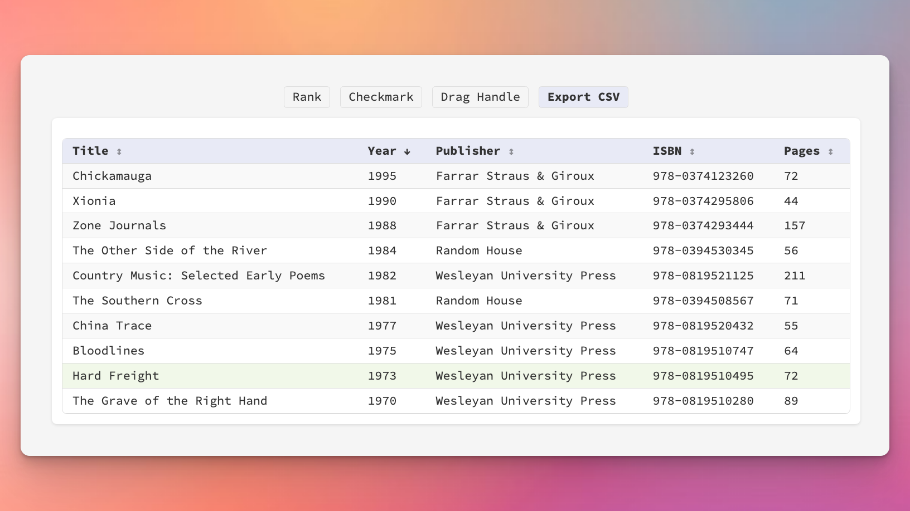

# CSV/TSV Viewer

A minimal, functional web application for uploading and viewing CSV and TSV (tab-separated values) files with advanced features like sorting, URL detection, and drag-and-drop row reordering.



## Features

- **Multiple file format support** - CSV, TSV, and TXT files with automatic delimiter detection
- **Drag-and-drop file upload** - Modern upload interface with visual feedback
- **Column sorting** - Click headers to sort ascending/descending with visual indicators
- **Resizable columns** - Drag column borders to adjust width for better readability
- **Automatic URL detection** - HTTP/HTTPS URLs become clickable links
- **Optional drag handle** - Reorder rows when enabled, freely select text when disabled
- **Toggle columns** - Show/hide rank and checkbox columns
- **Filter rows** - Show only checked rows
- **Bulk checkbox operations** - Check All, Check None, and Shift+Click range selection
- **Export CSV** - Download adjusted data with current sort/filter/order
- **Custom headers** - Use first row as headers or define your own
- **Minimal design** - Follows Source Code Pro aesthetic with pale color palette

## Project Structure

- **index.html**: The main HTML file that contains the front-end UI for the CSV uploader and viewer.
- **styles.css**: The CSS file that styles the front-end UI.
- **server.js**: The back-end server implemented with Express.js to handle file uploads and CSV parsing.
- **package.json**: The project manifest file that lists the project dependencies.

## Technologies Used

- **Front-End**:
  - HTML5
  - CSS3 (minimal design system using Source Code Pro font)
  - JavaScript (ES6+)
  - [PapaParse 5.3.0](https://www.papaparse.com/) for CSV/TSV parsing with automatic delimiter detection

- **Back-End**:
  - Node.js
  - Express.js
  - [Multer](https://www.npmjs.com/package/multer) for file upload handling
  - [fast-csv](https://c2fo.github.io/fast-csv/) for server-side CSV parsing

## Installation

1. Navigate to the project directory:

   ```bash
   cd node_csv_viewer
   ```

2. Install dependencies:

   ```bash
   npm install
   ```

## Usage

### Running in Production Mode

For Docker or production environments:

```bash
npm start
```

The server will start on `http://localhost:3000`

### Running in Development Mode (with auto-restart)

The term you're looking for is **"hot reload"** or **"auto-restart"**. This uses [nodemon](https://nodemon.io/) to automatically restart the server when you make changes to the code:

```bash
npm run dev
```

This will:
- Watch `server.js` and all files in `public/`
- Auto-restart when `.js`, `.html`, or `.css` files change
- Ignore `node_modules/` and `uploads/` directories

### Using the Application

1. Open your browser and go to `http://localhost:3000`
2. **Drag and drop** a CSV, TSV, or TXT file into the upload zone, or click "Choose File" to browse
   - Supported formats: `.csv`, `.tsv`, `.txt`
   - Delimiter is automatically detected (comma, tab, etc.)
3. Confirm whether to use the first row as headers
4. Use the toolbar options to customize your view:
   - **Rank** - Show row numbers
   - **Checkmark** - Add checkboxes to rows (reveals bulk actions)
   - **Drag Handle** - Enable row reordering (disables text selection)
   - **Show Only Checked Rows** - Filter to checked items (appears when checkboxes enabled)
   - **Export CSV** - Download current view (appears after adjustments)
5. **Column operations:**
   - **Click column headers** to sort (click again to reverse)
   - **Drag column borders** to resize for better readability
6. **Checkbox operations** (when enabled):
   - **Click checkbox** to check/uncheck individual rows
   - **Shift+Click** to select a range of rows
   - **Check All** to select all visible rows
   - **Check None** to clear all selections
7. **Click URLs** in cells to open in new tab

## Configuration

### Port Configuration

By default, the server runs on port `3000`. You can change this by setting the `PORT` environment variable:

```bash
PORT=8080 npm start
```

### Nodemon Configuration

The `nodemon.json` file controls auto-restart behavior:
- **Watched files**: `server.js` and `public/**/*`
- **File extensions**: `.js`, `.html`, `.css`
- **Ignored directories**: `node_modules/`, `uploads/`

## Docker Support

This application is designed to work both standalone and within Docker containers. The Docker configuration is managed at the parent directory level as part of the All-in-1-Docker-Containers setup.

For standalone use outside Docker, simply use `npm start` or `npm run dev` as described above.

## Error Handling

- Server handles uncaught exceptions and unhandled promise rejections gracefully
- Client-side CSV parsing errors are displayed to users via alerts
- Invalid file types trigger validation warnings

## Development

For active development with auto-restart on file changes:

1. Install dependencies including devDependencies: `npm install`
2. Run in dev mode: `npm run dev`
3. Make changes to `.js`, `.html`, or `.css` files
4. Server automatically restarts and reloads changes