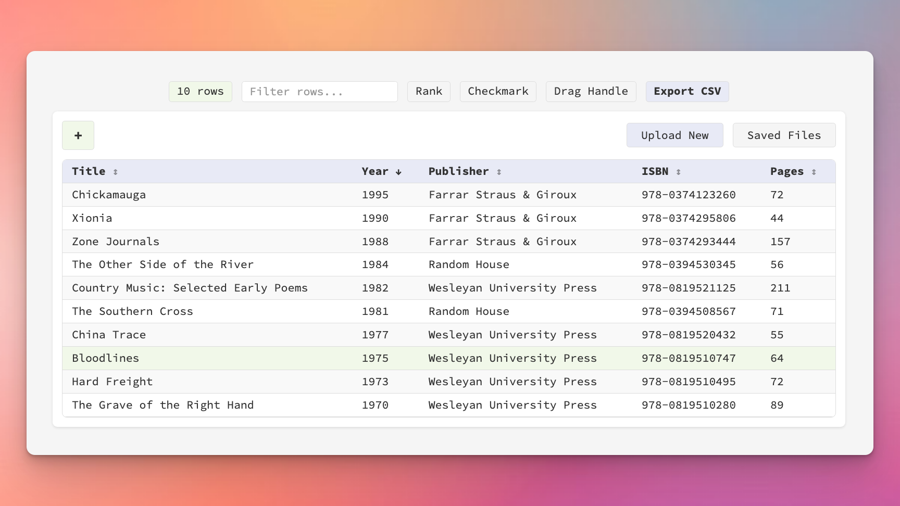

# CSV/TSV Viewer

A minimal, functional web application for uploading and viewing CSV and TSV (tab-separated values) files with advanced features like sorting, filtering, URL detection, auto-save, and drag-and-drop row reordering.



## Features

### File Management
- **Multiple file format support** - CSV, TSV, and TXT files with automatic delimiter detection via PapaParse
- **Drag-and-drop file upload** - Modern upload interface with visual feedback and drag-over styling
- **Saved files management** - Save CSV files to server, load previously saved files, rename and delete saved files
- **Tab-based interface** - Switch between uploading new files and browsing saved files
- **Auto-save functionality** - Changes to saved files are automatically saved after 500ms (debounced)
- **Large file support** - Chunked parsing with progress indicator for files up to 10MB

### Data Viewing & Manipulation
- **Smart header detection** - First row automatically becomes headers (no interruption)
- **Header management** - Change headers post-load with "+" button
- **Real-time filtering** - Filter rows across all columns as you type
- **Column sorting** - Click headers to sort ascending/descending with visual indicators
- **Resizable columns** - Drag column borders to adjust width for better readability
- **Automatic URL detection** - HTTP/HTTPS URLs become clickable links
- **Optional drag handle** - Reorder rows when enabled, freely select text when disabled

### Row Selection & Organization
- **Toggle columns** - Show/hide rank and checkbox columns with active state indicators
- **Filter rows** - Show checked rows only with "Show Checks" button (displays count)
- **Bulk checkbox operations** - Check All, Check None, Delete Checked, and Shift+Click range selection
- **Persistent checkboxes** - Checkbox states saved and restored in exported/saved files
- **Persistent rank** - Rank column state saved and restored in exported/saved files
- **Show All button** - Quickly clear all filters and return to full dataset
- **State preservation on reload** - UI state (filters, sort, column widths, checked rows) persists when reloading the same file

### Export Options
- **Export CSV** - Download to computer or save to server (available after significant adjustments)
- **Save button** - Quick save for currently loaded files (appears when file is from saved files)
- **State preservation** - Exports include Rank and Checked columns when enabled
- **Smart export** - Auto-save uses complete dataset; manual export respects current view/filters
- **Automatic .csv extension** - Extension added automatically when saving to server

### Design
- **Minimal design** - Follows Source Code Pro aesthetic with pale color palette (see STYLE_GUIDE.md)
- **High information density** - Efficient use of space without clutter, displays row counts with K notation
- **Active state indicators** - Visual feedback for enabled features (Rank, Checkmark, Drag Handle, Show Checks)
- **Loading indicators** - Progress display during file parsing with row count and file size
- **Auto-save indicator** - Visual feedback showing "Saving..." and "Saved" status

## Project Structure

- **public/index.html**: The main HTML file that contains the front-end UI for the CSV uploader and viewer
- **public/styles.css**: The CSS file that styles the front-end UI
- **server.js**: The back-end server implemented with Express.js to handle file operations and serve static files
- **package.json**: The project manifest file that lists the project dependencies
- **saved_csvs/**: Directory for storing saved CSV files and metadata (created automatically)
- **docs/**: Documentation including changelog and implementation plans
- **STYLE_GUIDE.md**: Design system specification for minimal aesthetic

## Technologies Used

- **Front-End**:
  - HTML5
  - CSS3 (minimal design system using Source Code Pro font)
  - JavaScript (ES6+)
  - [PapaParse 5.3.0](https://www.papaparse.com/) for CSV/TSV parsing with automatic delimiter detection

- **Back-End**:
  - Node.js 20+ (Alpine-based Docker image)
  - Express.js 4.18.2
  - [Multer 2.0.2](https://www.npmjs.com/package/multer) for file upload handling and storage
  - JSON-based metadata tracking for saved files

## Installation

1. Navigate to the project directory:

   ```bash
   cd csv-viewer
   ```

2. Install dependencies:

   ```bash
   npm install
   ```

3. Ensure `saved_csvs/` directory exists (created automatically on first save)

## Usage

### Running in Production Mode

For Docker or production environments:

```bash
npm start
```

The server will start on `http://localhost:3000`

### Running in Development Mode (with auto-restart)

This mode uses [nodemon](https://nodemon.io/) to automatically restart the server when you make changes to the code (also known as "hot reload" or "auto-restart"):

```bash
npm run dev
```

This will:
- Watch `server.js` and all files in `public/`
- Auto-restart when `.js`, `.html`, or `.css` files change
- Ignore `node_modules/` and `uploads/` directories

### Using the Application

1. Open your browser and go to `http://localhost:3000`
2. **Choose between two tabs:**
   - **Upload New** - Upload a new CSV file
   - **Saved Files** - Browse, load, rename, or delete previously saved files

#### Upload New Tab
3. **Drag and drop** a CSV, TSV, or TXT file into the upload zone, or click "Choose File" to browse
   - Supported formats: `.csv`, `.tsv`, `.txt`
   - Delimiter is automatically detected (comma, tab, etc.)
   - First row automatically becomes headers (no alert interruption)
4. **Optional:** Click the pale green "+" button if you need to change headers
   - Choose "Use next row as headers" to shift data up one row
   - Or enter custom headers manually
5. Use the toolbar options to customize your view:
   - **Row count badge** - Displays current visible row count (e.g., "1.2K rows")
   - **Auto-save indicator** - Shows "Saving..." / "Saved" for files from saved files
   - **Show All** - Clear all filters and return to full dataset (appears when filtering)
   - **Filter rows...** - Type to filter rows in real-time across all columns
   - **Rank** - Show row numbers (persists when exported and reloaded)
   - **Checkmark** - Add checkboxes to rows (persists when exported and reloaded)
   - **Show Checks** - Filter to checked items only with count (appears when checkboxes enabled)
   - **Drag Handle** - Enable row reordering (disables text selection)
   - **Save** - Quick save for loaded files (appears for files from saved files)
   - **Export** - Download to computer or save to server (appears after significant adjustments)
6. **Column operations:**
   - **Click column headers** to sort (click again to reverse, visual indicators show sort direction)
   - **Drag column borders** to resize for better readability (minimum 50px width)
   - **Column widths persist** on file reload if headers match
7. **Checkbox operations** (when enabled):
   - **Click checkbox** to check/uncheck individual rows (triggers auto-save)
   - **Shift+Click** to select a range of rows
   - **Check All** - Bulk action to select all visible rows
   - **Check None** - Bulk action to clear all selections
   - **Delete Checked** - Bulk action to permanently remove checked rows (with confirmation)
8. **Click URLs** in cells to open in new tab (automatic detection for http:// and https://)
9. **Drag and drop rows** (when drag handle enabled):
   - **Drag ⠿ handle** to reorder rows
   - Reordering triggers auto-save and marks file as adjusted
10. **Export options:**
   - **Click "Export"** to open export dialog (appears after significant adjustments)
   - **Choose "Download to computer"** to save locally with timestamp
   - **Choose "Save to server"** to save for later access (prompts for filename)
   - **Note:** Rank and Checked columns are included in export when enabled
11. **Auto-save** - Files loaded from saved files auto-save after 500ms of inactivity

#### Saved Files Tab
12. **View saved files** - See list of all saved CSV files with metadata (filename, size, last modified)
    - Files sorted by newest first
    - Human-readable relative timestamps ("2h ago", "Yesterday", etc.)
13. **Load a file** - Click "Load" to open a saved file in the viewer
    - Rank and checkbox states are automatically restored if they were saved
    - Checkbox and rank buttons will be automatically enabled
    - Auto-save is activated for loaded files
14. **Rename a file** - Click "Rename" to edit the filename inline
    - Press Enter to save, Escape to cancel
    - Click outside to save changes
15. **Delete a file** - Click "Delete" to permanently remove a saved file (requires confirmation)
16. **Collapse/expand** - Click "Saved Files" tab again to toggle the file list visibility

## API Endpoints

The application provides RESTful endpoints for managing saved CSV files:

### File Management API

- **GET /api/saved-files** - List all saved CSV files with metadata (validates existence before returning)
- **POST /api/upload** - Upload and save a CSV file (10MB limit, multipart/form-data, sanitizes filenames)
- **GET /api/file/:filename** - Download a specific saved CSV file
- **PUT /api/rename/:filename** - Rename a saved CSV file (requires JSON body with `newFilename`, prevents overwrites)
- **PUT /api/update/:filename** - Update the content of a saved CSV file (50MB JSON body limit)
- **DELETE /api/delete/:filename** - Delete a saved CSV file

### Storage

Saved files are stored in the `saved_csvs/` directory with metadata tracked in `saved_csvs/metadata.json`.

#### Metadata Reliability

The application uses a dual-layer synchronization strategy to ensure metadata accuracy:

- **Startup Sync:** On server start, metadata is automatically synchronized with actual files on disk, removing any orphaned entries for missing files
- **Runtime Validation:** The `/api/saved-files` endpoint validates file existence before returning results, ensuring clients never receive references to missing files
- **Self-Healing:** If CSV files are manually deleted from the `saved_csvs/` directory, they are automatically removed from metadata on the next server restart

This design prevents errors when files are manually managed outside the API.

## Configuration

### Port Configuration

By default, the server runs on port `3000`. You can change this by setting the `PORT` environment variable:

```bash
PORT=8080 npm start
```

### File Upload Limits

- Maximum file size: 10MB (upload), 50MB (JSON body for updates)
- Allowed formats: .csv, .tsv, .txt
- Filenames are automatically sanitized (only alphanumeric, dots, dashes, underscores)

### Nodemon Configuration

The `nodemon.json` file controls auto-restart behavior:
- **Watched files**: `server.js` and `public/**/*`
- **File extensions**: `.js`, `.html`, `.css`
- **Ignored directories**: `node_modules/`, `uploads/`

## Docker Support

This application is designed to work both standalone and within Docker containers.

### Docker Configuration

The included `Dockerfile` uses:
- Base image: `node:20-alpine` (lightweight Alpine Linux)
- Working directory: `/app`
- Exposed port: 3000 (configurable via `PORT` environment variable)
- Production dependencies only (`npm install --omit=dev`)

### Building and Running with Docker

```bash
# Build the image
docker build -t csv-viewer .

# Run the container
docker run -p 3000:3000 csv-viewer

# Run with custom port
docker run -p 8080:8080 -e PORT=8080 csv-viewer
```

### Persisting Saved Files in Docker

By default, saved CSV files are stored inside the Docker container and will be lost when the container is recreated. To persist saved files on your host machine, mount a volume:

```bash
# Run with volume mount for persistence
docker run -p 3000:3000 -v $(pwd)/saved_csvs:/app/saved_csvs csv-viewer
```

Or in `docker-compose.yml`:

```yaml
version: '3.8'
services:
  csv-viewer:
    build: .
    ports:
      - "3000:3000"
    volumes:
      - ./saved_csvs:/app/saved_csvs
    environment:
      - PORT=3000
```

## Error Handling

- Client-side CSV parsing errors are displayed to users with detailed error messages
- Invalid file types trigger validation warnings
- Metadata automatically syncs with disk on server startup to prevent orphaned entries
- Runtime validation ensures files exist before returning in API responses
- Empty files and parsing errors are handled gracefully with user feedback
- Chunked parsing prevents browser freezing on large files
- Loading indicators with progress feedback (row count, file size)

## Performance & Limitations

### Current Performance
- Successfully handles files with thousands of rows
- Chunked parsing with progress indicators for large files
- Uses K notation for large row counts (e.g., "2.5K rows")
- Debounced auto-save (500ms) to reduce server load

### Known Limitations
- Performance degrades on very large files (4MB+)
- Search functionality may benefit from optimization for large datasets
- Future enhancements under consideration (see `todo.md`)

## Development

For active development with auto-restart on file changes:

1. Install dependencies including devDependencies: `npm install`
2. Run in dev mode: `npm run dev`
3. Make changes to `.js`, `.html`, or `.css` files
4. Server automatically restarts and reloads changes
5. Nodemon watches `server.js` and `public/**/*` files
